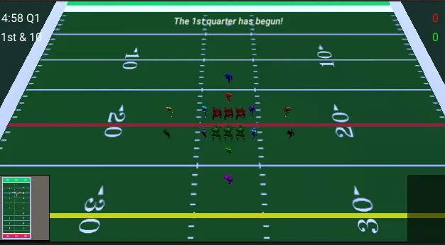
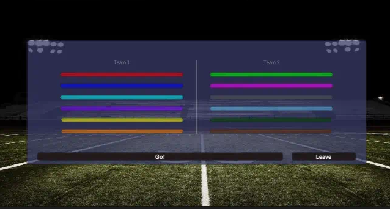

# RUN Football

RUN Football is real-time football you command, not a player you puppet. You select people on the field and give them orders while the play is still live.

It comes from [W.a.L.K. Football](https://www.epicwar.com/maps/11756/), a Warcraft 3 custom map that treated football like a small-army RTS: 8–12 people, click to move, fight for yards. You do not need that map. If you know downs, a line of scrimmage, and a quarterback who can throw farther than a lineman, you already have the shape of the field. The hands are different. This is click-to-order football, in its own engine.

## A play

Both teams line up on the **red** line of scrimmage. The **yellow** line is first down.

Left-click selects (drag a box if you want more than one). Right-click the grass to send them there. Right-click a person to go to them. Hold Shift to queue. Right-click again to cancel an ability you had armed.

That is most of the game. The rest is the few things a body can do with a football:

- **Hike** starts the play.
- **Throw** is a click on the ground. A quarterback can throw the length of the field. A receiver who heaves it is working with a dump-off.
- **Catch** is being in the window when the ball gets there — a few yards of the throw line, not a timing minigame.
- **Tackle** is the short stop. You have to be close. It comes back quickly.
- **Stiff** is a close-range punch-through. Longer wait to use it again.
- **Juke** is a brief slip.
- **Charge** is a several-second burst, then a long wait.

What you click is an order. What actually happens is decided on the server. The client is eyes and hands.

## Who you command

A slot is a position, not a skin.

| | On the field | Feet | Throw |
| --- | --- | --- | --- |
| **QB** | The deep ball | Slowest skill player | Far |
| **RB** | Fastest; useful short throw | Fastest | Short–medium |
| **WR** | Fast; almost no arm | Fast | Dump |
| **TE** | Between WR and line | Mid | Short |
| **Lineman** | The pile | Slowest | Don't |

The numbers behind that (relative speeds 6 down to 4, throw ranges 60 / 20 / 15 / 10) live on the server. The table is so you know why the yellow one outruns the black one, and why only some people should be throwing.

## A match

Four quarters, five minutes each. The corner HUD is the whole state of the drive: clock and quarter (`4:58 Q1`), down and distance (`1st & 10`), the two scores in team colors. Red versus green. Up to six people a side, twelve in a lobby. If both teams are present, a coin flip decides who starts with the ball.

Type a name, join, click a slot, hit **Go!** when the group is ready. **Leave** dumps you back out.

## Where this is

Version `0.4.0`. The match plays: field, orders, lobby, clock, server-side rules. It is not a 1.0.

The other half of the game is the dedicated server: [RFB_Server-archive](https://github.com/mpsuesser/RFB_Server-archive).
